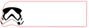

# Laser Cutter Files

This is a collection of SVG files that I built to use with my laser cutter. Please download, laser cut and modify them.

## Uno Logo

I grabbed the UNO logo from wikipedia, but it it had a bunch of overlapping layers which caused overlapping lazer engraving. So I used the image as my source and created a file with no overlapping layers for good laser cuttting.

## Storm Trooper Bookmark

My love for Star Wars quickly showed itself in a few early laser cutting projects including this bookmark. This file could also be used with a vinyl cutter if you have one.

## Bottle Cap Coaster

Take your bottlecaps and insert them into this coaster. I saw several [Etsy shops selling these](https://www.etsy.com/search?q=bottle%20cap%20coaster) and I thought *I can make that myself*. It took a bit of experimenting to get the size right and add some pegs in the openings to hold the bottle caps, but I'm happy with the results.

Some tips if you use this one:
* If you don't want the bottle caps to extend above the wood, use 1/4 inch thick wood instead of 1/8.
* Buy some [cork coasters](https://www.hobbylobby.com/crafts-hobbies/wood-crafts-blank-surfaces/cork-boards/square-cork-coasters---6-pack/p/80913345) and use them on the underside of your bottle cap coaster
* Consider spraying with a [non-slip coating](https://www.amazon.com/Odif-43602-Grippy-Non-Slip-Coating/dp/B07PNRR717) so glassware doesn't slip off the smooth caps

## Blade Runner Unicorn

The iconic shape of Gaff's origami unicorn in an SVG that you can laser cut or vinyl cut.

## Starbucks Cup

One of the most fun parts of laser cutting is creating shapes that you don't think you should be able to do with wood, including cylinders and cones. I was thinking about this while buying a coffee at Starbucks and the inspiration struck to create the shape of a Starbuck's cup with my laser cutter.

I disassembled the cup, traced its outline onto a piece of paper, measured all the dimensions and carefully reproduced it as an SVG.

In order to create a rounded shape you cut a series of lines that run parallel to each other in a tight formation. I started with a box design I downloaded from [Boxes.py](https://lnkd.in/gpXs75nh) that had a flexible hinge. I extracted that flexible hinge into its own file and then began adjusting the lines to form a cone instead of parallel lines.

I'm not including the Starbuck's logo in my file for copyright reasons, but the original looked like this:

You'll notice the smooth edges on the right and left sides of the SVG file. This necessitated gluing the edges together, so the next iteration of the Starbuck's cup was to create interlocking teeth that would hold the cup edges together.

## Starbucks Sleeve

What's a Starbuck's cup without a sleeve? This file is simply a smaller version of the Starbuck's cup.

## Dovetail Template

To make the edges of my Starbuck's cup connect without using glue, I made a dovetail on both edges. This file is the template that I created as a separate file so I would use it for other projects.

## Scissor Case

This file is a scissor case similar to [some found on Etsy](https://www.etsy.com/search?q=wooden+scissor+case&ref=search_bar). I made a few of them for Christmas gifts last year.

You'll want to print two of the inner layer. One inner layer glues to the top of the case; the second inner layer glues to the bttom of the case. The round holes in the inner layers are there to put in small magnets which hold the top and bottom layers together.

## Starbucks Lid

This is my second attempt at creating a lid for the Starbucks cup. The layer names indicate both quantity and assembly position. For instance, "Layer One & Three" means cut two circles for the first and third positions in the stack. "Layer Three, Four & Five" means cut three identical circles to use in positions 3-5. If there are two layers with the same position (like layer three), that means both layers will be assembled together (on top of layer two). The lid assembles like a layer cake from bottom to top.

I'm still not satisfied with the aesthetic. On to version 3.
